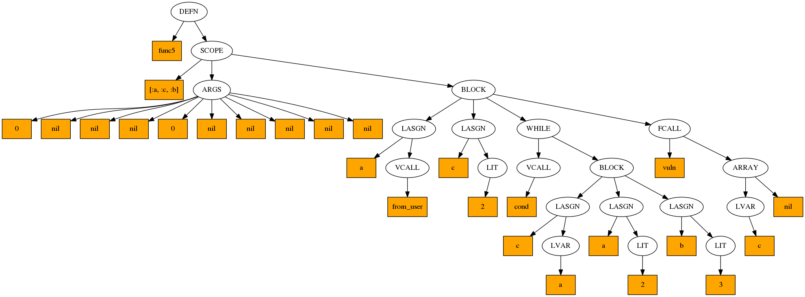
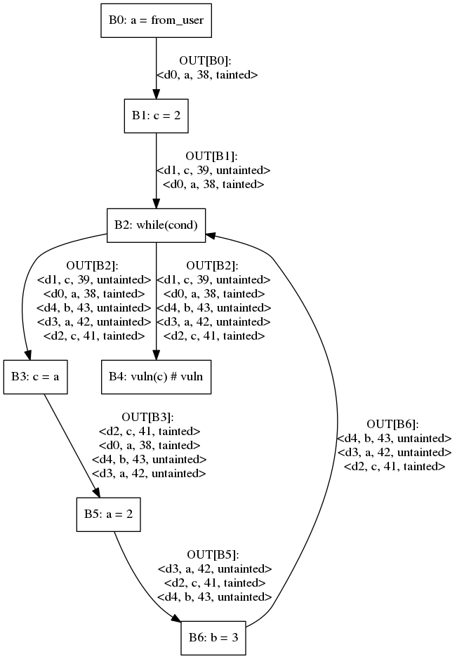

# Description

This is not a real static analyzer but a toy project to learn and put ideas and algorithm into practice.

# Limitations
* The things already implemented operate on named function only
* No module or class support
* Simple CFG (ex.: if/else, while, .upto)
* Very very simple intraprocedural taint analysis
* No sanitization support

# How to test it
```
ruby main.rb --ast2png --cfg2png --find-vulns -w workspac0 samples/vuln.rb
[*] Computing reaching definition for func0
================================================================================
[*] Computing reaching definition for func1
================================================================================
[*] Computing reaching definition for func2
================================================================================
[*] Computing reaching definition for func3
================================================================================
[*] Computing reaching definition for func4
================================================================================
[*] Computing reaching definition for func5
================================================================================
[*] Computing taint propagation for func0
================================================================================
[*] Computing taint propagation for func1
================================================================================
[*] Computing taint propagation for func2
================================================================================
[*] Computing taint propagation for func3
================================================================================
[*] Computing taint propagation for func4
================================================================================
[*] Computing taint propagation for func5
================================================================================
[*] Saving AST of func0
================================================================================
[*] Saving AST of func1
================================================================================
[*] Saving AST of func2
================================================================================
[*] Saving AST of func3
================================================================================
[*] Saving AST of func4
================================================================================
[*] Saving AST of func5
================================================================================
[*] Saving CFG of func0
================================================================================
[*] Saving CFG of func1
================================================================================
[*] Saving CFG of func2
================================================================================
[*] Saving CFG of func3
================================================================================
[*] Saving CFG of func4
================================================================================
[*] Saving CFG of func5
================================================================================
[*] Finding dangerous fcall in func0
    Trace:
      Location: samples/vuln.rb:5
================================================================================
[*] Finding dangerous fcall in func1
    Trace:
      Location: samples/vuln.rb:9
        Location: samples/vuln.rb:10
================================================================================
[*] Finding dangerous fcall in func2
================================================================================
[*] Finding dangerous fcall in func3
================================================================================
[*] Finding dangerous fcall in func4
    Trace:
      Location: samples/vuln.rb:30
        Location: samples/vuln.rb:34
================================================================================
[*] Finding dangerous fcall in func5
    Trace:
      Location: samples/vuln.rb:38
        Location: samples/vuln.rb:41
          Location: samples/vuln.rb:45
================================================================================

```

# Example of results generated by the analyzer
## Code
```ruby
37: def func5
38:  a = from_user
39:  c = 2
40:  while(cond)
41:    c = a
42:    a = 2
43:    b = 3
44:  end
45:  vuln(c) # vuln
46: end
```

## AST


## CFG


## Tainted use
```
[*] Finding dangerous fcall in func5
    Trace:
      Location: samples/vuln.rb:38
        Location: samples/vuln.rb:41
          Location: samples/vuln.rb:45
```